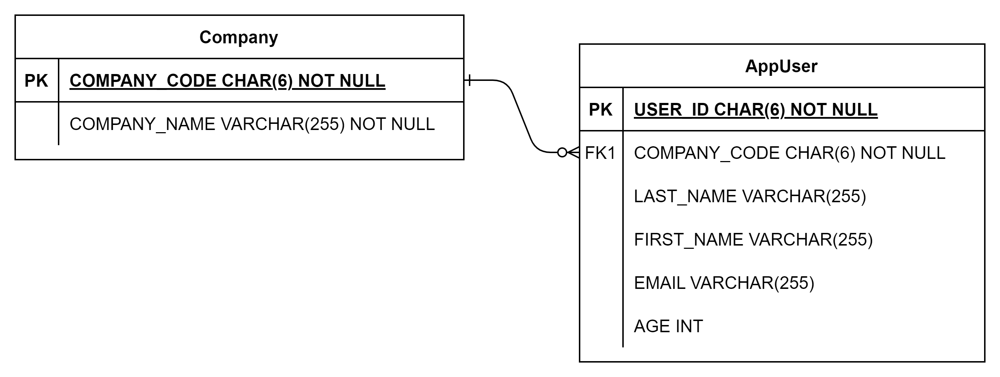
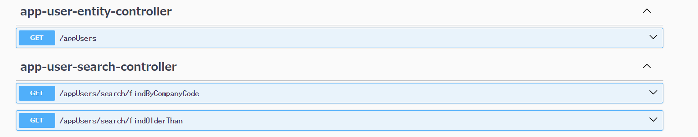

# spring-data-rest-handson

# 目次

1. ハンズオンの目的
2. Spring Data REST とは
3. 自動生成された エンドポイントを使ってみよう (GET, POST, PUT, PATCH, DELETE)
4. エンドポイントを増やしてみよう

   4-1. 独自のクエリメソッドを追加する（JPA 黒魔術メソッド編）

   4-2. 独自のクエリメソッドを追加する（@Query アノテーション 編）

   4-3. エンドポイントを一から作ってみよう（/companies）

5. レスポンスのオブジェクトをネストさせよう（/users で紐づく company を返す）
6. エンドポイントのカスタマイズ（PK を返す設定、公開設定）

# 1. ハンズオンの目的

## このハンズオンでやること

このハンズオンでは、Spring Data REST を用いて、会社テーブルとユーザーテーブルに CRUD するようなエンドポイントを自動生成します。



## このハンズオンのゴール

- Spring Data REST で生成されるエンドポイントの I/F を理解している
- Spring Data REST を用いて、エンドポイントを自動生成することができる
- 1 つのエンドポイントで関連する別の Entity を取得することができる
- N+1 問題が発生しないコーディングができる
- Spring Data REST におけるエンドポイントをある程度カスタマイズできる

# 2. Spring Data REST とは

> Spring Data REST は Spring Data のライブラリの一つであり、Spring Data REST は、Spring Data で作成したリポジトリを RESTful なエンドポイントとして自動的に公開します。Spring Data REST の機能を利用することによって、Controller や Service クラスの実装を省略する事ができるということです。

出典：[Spring Data REST の要点と利用方法](https://qiita.com/umiushi_1/items/b369f659bbd94576b8f4#spring-data-rest%E3%81%A8%E3%81%AF)

公式レファレンス：https://spring.pleiades.io/spring-data/rest/reference/

# 3. 自動生成された エンドポイントを使ってみよう (GET, POST, PUT, PATCH, DELETE)

まずは、アプリケーションを起動してみましょう。

```shell
./gradlew bootRun
```

起動したら、

> http://localhost:8080/swagger-ui

を開きます。

すると、


こんな感じの I/F 仕様書が表示されます。

プリセットの状態では、2 種類のエンドポイントがすでに作成済みです。

- ①：Controller, Service から作った従来通りの API（Customized Users）
- ②：Spring Data REST で自動生成した API（app-user-entity-controller）

① は、src/main/java/com/example/demo/controller/AppUserController.java に Controller が定義されています。

② は、Spring Data REST で自動生成しているため Controller が存在しません。
あるのは Repository（src/main/java/com/example/demo/repository/AppUserRepository.java）のみです。

デフォルトで生成される HTTP メソッドと、そこで呼び出されるメソッドの対応については、公式レファレンスを参照。

> 公式レファレンス：[サポートされている HTTP メソッド](https://spring.pleiades.io/spring-data/rest/reference/repository-resources.html#repository-resources.collection-resource.supported-methods)

では、生成されたエンドポイントを swagger 上で叩いてみて、どのようなデータが返ってくるか試してみましょう。ちなみに DB は H2 DataBase を利用しており、初期状態では src/main/resources/data.sql 内のレコードが流し込まれます。

# 4. エンドポイントを増やしてみよう

## 4-1. 独自のクエリメソッドを追加する（JPA 黒魔術メソッド編）

### 課題 1:

AppUserRepository にメソッドを追加して、クエリパラメータ「companyCode」で App_User を検索できるエンドポイントを生成してください。

<details><summary>課題 1　実装例</summary>

```java
package com.example.demo.repository;

import org.springframework.data.jpa.repository.JpaRepository;

import com.example.demo.entity.AppUser;

import java.util.List;

public interface AppUserRepository extends JpaRepository<AppUser, String> {
    public List<AppUser> findByCompanyCode(String companyCode);
}

```

</details>

## 4-2. 独自のクエリメソッドを追加する（@Query アノテーション 編）

### 課題 2:

AppUserRepository にメソッドを追加して、クエリパラメータ「age」よりも年上の App_User を検索できるエンドポイントを生成してください。

ただし、ここでは練習のため"findByAgeGreaterThan"は使わず、"findOlderThan"というメソッド名にしたうえで、@Query アノテーションを使ってみてください。

<details><summary>課題 2　実装例</summary>

```java
package com.example.demo.repository;

import org.springframework.data.jpa.repository.JpaRepository;
import org.springframework.data.jpa.repository.Query;

import com.example.demo.entity.AppUser;

import java.util.List;

public interface AppUserRepository extends JpaRepository<AppUser, String> {
    public List<AppUser> findByCompanyCode(String companyCode);

    @Query("SELECT user FROM AppUser user WHERE user.age > :age")
    public List<AppUser> findOlderThan(Integer age);
}

```

</details>

## 4-3. エンドポイントを一から作ってみよう（/companies）

### 課題 3:

CompanyRepository を新規作成し、Company を CRUD するエンドポイントを生成してください。

<details><summary>課題 3　実装例</summary>

```java
package com.example.demo.repository;

import org.springframework.data.jpa.repository.JpaRepository;

import com.example.demo.entity.Company;

public interface CompanyRepository extends JpaRepository<Company, String> {
}
```

</details>

# 5. レスポンスのオブジェクトをネストさせよう（/users で紐づく company を返す）

ここまでで /appUsers と/companies の API を作成できましたが、ユーザーと会社のリレーションがまだ表現されていません。

各 Entity にリレーションを定義しましょう。

- AppUser.java

```java
@Data
@Entity
public class AppUser {
    @Id
    @Column(name = "USER_ID", nullable = false)
    private String userId;

----------------------------（略）----------------------------

    @ManyToOne
    @JoinColumn(name = "COMPANY_CODE", nullable = false, insertable = false, updatable = false)
    private Company company;

}
```

- Company.java

```java
@Data
@Entity
public class Company {
    @Id
    @Column(name = "COMPANY_CODE", nullable = false)
    private String companyCode;

----------------------------（略）----------------------------

    @OneToMany
    @JoinColumn(name = "COMPANY_CODE", nullable = false, insertable = false, updatable = false)
    private List<AppUser> appUsers;
}
```

ちなみに、

```
insertable = false, updatable = false
```

がないと怒られます。おまじないとして覚えておきましょう。

この状態でアプリを起動し、/appUsers や/companies を叩いてみましょう。

```json
{
  "firstName": null,
  "lastName": "木野1",
  "email": "kino1@example.com",
  "age": 48,
  "companyCode": "com001",
  "_links": {
    "self": {
      "href": "http://localhost:8080/appUsers/u001"
    },
    "appUser": {
      "href": "http://localhost:8080/appUsers/u001"
    },
    "company": {
      "href": "http://localhost:8080/appUsers/u001/company"
    }
  }
}
```

こんな感じで、"\_links"に参照先のエンティティが出てくるはずです。

### クイズ

さて、I/F とは無関係に、今なにかまずいことが起きています。なんでしょう。
（ヒント：ログ）

<details><summary>答え</summary>

N+1 問題が発生している。
→ JOIN FETCH するコードに修正します。

- AppUserRepository に JOIN FETCH するクエリメソッドを追加

```java
public interface AppUserRepository extends JpaRepository<AppUser, String> {
    @Query(value = "select user from AppUser user left join fetch user.company")
    List<AppUser> findAllUsersWithCompany();
}
```

</details>

### "\_links"ではなく、直接オブジェクトをネストさせる

"\_links"に参照先のエンティティが出てくるようになったものの、/appUsers のレスポンス内に直接 company をネストさせたい場合はどうすればいいでしょうか。

- AppUser の Projection を追加

  参考：[射影と抜粋](https://spring.pleiades.io/spring-data/rest/reference/projections-excerpts.html)

```java
package com.example.demo.projection;

import org.springframework.data.rest.core.config.Projection;

import com.example.demo.entity.AppUser;
import com.example.demo.entity.Company;

@Projection(name = "AppUserExcerpt", types = { AppUser.class })
public interface AppUserExcerpt {

    public String getUserId();

    public String getFirstName();

    public String getLastName();

    public String getEmail();

    public int getAge();

    public Company getCompany();
}
```

- AppUserRepository に AppUserExcerpt を適用する

```java
@RepositoryRestResource(excerptProjection = AppUserExcerpt.class)
public interface AppUserRepository extends JpaRepository<AppUser, String> {
  ----------------------------（略）----------------------------
}
```

この状態でアプリを起動し、/users/search/findAllUsersWithCompany を叩いてみましょう。

```json
{
  "email": "kino1@example.com",
  "age": 48,
  "userId": "u001",
  "firstName": null,
  "lastName": "木野1",
  "company": {
    "companyName": "会社01"
  }
}
```

このように、company のオブジェクトをネストさせることができました。
改めて、N+1 問題が発生していないことを確認しましょう。

# 6. エンドポイントのカスタマイズ（PK を返す設定、公開設定）

## PK を返す設定を入れる

Spring Data REST はデフォルトではなぜか Entity の PK を返してくれません。困るので、PK を返す設定を入れましょう。

- RepositoryConfig.java

/config/RepositoryConfig.java という設定が定義されているので、config.exposeIdsFor の引数に PK を返したい Entity クラスを指定します。

```java
package com.example.demo.config;

import org.springframework.context.annotation.Configuration;
import org.springframework.data.rest.core.config.RepositoryRestConfiguration;
import org.springframework.data.rest.webmvc.config.RepositoryRestConfigurer;
import org.springframework.web.servlet.config.annotation.CorsRegistry;

import com.example.demo.entity.AppUser;
import com.example.demo.entity.Company;

@Configuration
public class RepositoryConfig implements RepositoryRestConfigurer {
    @Override
    public void configureRepositoryRestConfiguration(
            RepositoryRestConfiguration config, CorsRegistry cors) {
        config.exposeIdsFor(
                AppUser.class, Company.class);
    }
}
```

## デフォルトでは Public な Spring Data Repository が全て公開されてしまうため、デフォルト値の設定を変える

- application.properties

application.properties に次の一行を追記します。

```
spring.data.rest.detection-strategy=ANNOTATED
```

これを書くことで、@RepositoryRestResource アノテーションが付いていない Repository は公開されなくなります。

## デフォルトでは Repository に対応する全ての HTTP メソッドが生成されてしまうので、元になる JPA メソッドをオーバーライドして@RestResource(exported = false)アノテーションを付ける

- DefaultFalseRepository.java

ここでは、元になる JPA メソッドをオーバーライドして@RestResource(exported = false)アノテーションを付けています。

```java
@RepositoryRestResource
@NoRepositoryBean
public interface DefaultFalseRepository<T, ID extends Serializable> extends Repository<T, ID> {
    @RestResource(exported = false)
    List<T> findAll();

    @RestResource(exported = false)
    Page<T> findAll(Pageable pageable);

    @RestResource(exported = false)
    List<T> findAll(Sort sort);

    @RestResource(exported = false)
    T findById(ID id);

    @RestResource(exported = false)
    <S extends T> S save(S entity);

    @RestResource(exported = false)
    void deleteById(ID id);
}
```

- AppUserRepository.java

各 Repository で DefaultFalseRepository を継承します。
公開したい JPA メソッドは、DefaultFalseRepository のメソッドをオーバーライドして、@RestResource(exported = true)に上書きします。

```java
@RepositoryRestResource
public interface AppUserRepository extends DefaultFalseRepository<AppUser, String> {
    @Override
    @RestResource(exported = true)
    Page<AppUser> findAll(Pageable pageable);

    public List<AppUser> findByCompanyCode(String companyCode);

    @Query("SELECT user FROM AppUser user WHERE user.age > :age")
    public List<AppUser> findOlderThan(Integer age);
}
```

これにより、自分で明示的に追加したメソッドのみが公開されます。



## "\_embedded"内の"\_links"をなくす設定

"\_embedded"内の"\_links"を消したい場合、次の設定を追加します。

- RepresentationModelProcessorConfiguration.java

```java
package com.example.demo.config;

import org.springframework.context.annotation.Bean;
import org.springframework.context.annotation.Configuration;
import org.springframework.hateoas.EntityModel;
import org.springframework.hateoas.server.RepresentationModelProcessor;

@Configuration
public class RepresentationModelProcessorConfiguration {

    @Bean
    public RepresentationModelProcessor<EntityModel<Object>> estEstimateProcessor() {
        return new RepresentationModelProcessor<EntityModel<Object>>() {
            @Override
            public EntityModel<Object> process(EntityModel<Object> model) {
                return EntityModel.of(model.getContent());
            }
        };
    }
}
```

# 参考文献

- [公式レファレンス](https://spring.pleiades.io/spring-data/rest/reference/)
- [Spring Data REST の要点と利用方法](https://qiita.com/umiushi_1/items/b369f659bbd94576b8f4#spring-data-rest%E3%81%A8%E3%81%AF)
- [GraphQL サーバと REST サーバをさっと立ちあげて、実際に触ってみる](https://qiita.com/masatomix/items/53003a34d413206bb619)
- [GraphQL サーバと REST サーバをさっと立ちあげて、実際に触ってみる。つづき。関連のあるデータの取得](https://qiita.com/masatomix/items/d52ef0bdeb131f9dd6f7)
