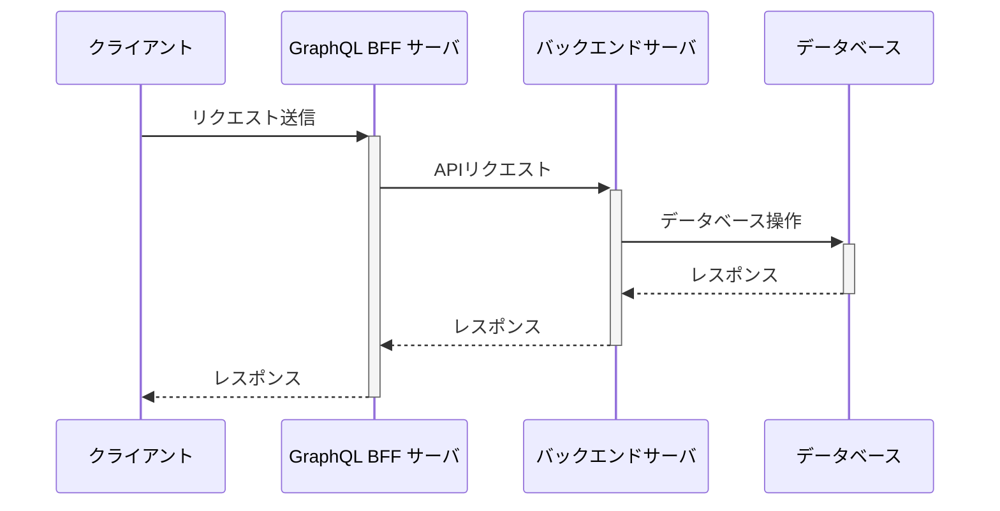
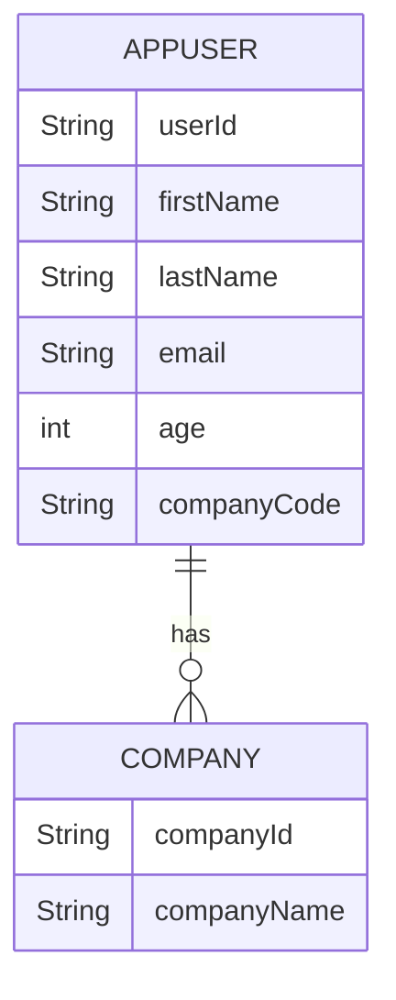
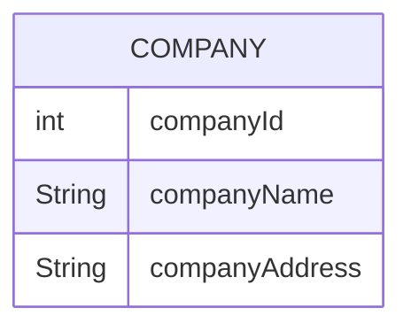
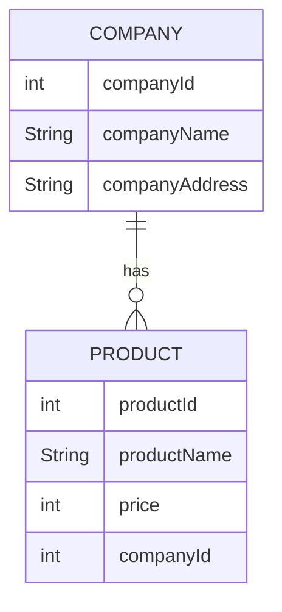

# BFF + BACKEND

# 環境構築

[前提となる環境構築](../00.環境構築/README.md)が完了している前提

## BFF

1. 依存関係のインストール

```sh
# リポジトリルートから
cd 03.bff+backend/bff
nvm use # .npmrc
corepack enable pnpm
pnpm -v # 9.4.0
pnpm i
```

2. バックエンドのプロキシコード生成

```sh
# リポジトリルートから
cd 03.bff+backend/backend
# 別ターミナルでバックエンドのサーバを起動している状態で(起動方法は以下参照)
./gradlew openApiClean openApiGenerate
```

## バックエンド

前提の環境構築が完了していれば特になし。

# サーバ起動

## BFF

```sh
# リポジトリルートから
cd 03.bff+backend/bff
pnpm dev
```

## バックエンド

```sh
cd 03.bff+backend/backend
./gradlew bootRun
```

# 前提情報

## システム構成/APIリクエストシーケンス

localhost:3000にBFFサーバ、localhost:8080にバックエンドサーバがアップしており、以下のシーケンスでリクエストをします。



## 各エンドポイントの状況

### BFF

`http://localhost:3000/graphql`をブラウザで開くことでクエリのエディタが表示されます。

`http://localhost:3000/graphql-view`にアクセスすることでビジュアルにノード間の関係性を確認できます。

### バックエンド

`http://localhost:8080/swagger-ui/index.html#/`にアクセスすることでバックエンドの各エンドポイント情報を確認できます。

# NestJS補足情報

## NestJSとは

JavaScriptのサーバサイドフレームワークのことです。JavaScriptのSpringBootみたいなもの。

## NestJSでGraphQLをやる

NestJSでGraphQLをやるとき、GraphQLの登場人物（Schema/Resolver）が「クラス」と「アノテーション」で表現されます。

例えば、以下のようなGraphQLのスキーマは

```gql
type User {
  id: String!
  name: String!
  company: Company!
}
```

以下のように書くことで実装できます(`bff/src/graphql/user/models/user.model.ts`)。

```ts
import { Field, ObjectType } from "@nestjs/graphql";
import { Company } from "src/graphql/company/models/company.model";

@ObjectType() // GraphQLのtypeであることを表現するアノテーション
export class User {
    @Field(() => String) // クラス内の各プロパティのGraphQLでのマッピング(id: String!)と対応する。
    id: number;
    @Field(() => String)
    name: string;
    @Field(() => Company)
    company: Company;
}
```

リゾルバーは以下のようになります。

例えば、以下のようなクエリがあるとき、

```gql
type Query {
    users(page: Int, size: Int, sort: [String!]): [User!]!
}
```

Resolverは以下のように実装できます(`bff/src/graphql/users/users.resolver.ts`)。

```ts
import { Args, Query, Resolver } from "@nestjs/graphql";
import { User } from "../user/models/user.model";
import {
    AppUserEntityControllerService,
    EntityModelAppUser,
} from "src/generated";
import { map, Observable } from "rxjs";
import { UserArgs } from "./models/users.args";

@Resolver() // リゾルバーであることを意味するアノテーション
export class UsersResolver {
    constructor(private readonly userService: AppUserEntityControllerService) {} // DIするインスタンス(Spring Bootの@Autowiredと同じ)
    @Query(() => [User]) // [User]を返すQueryであることを意味する。
    public users(
        @Args() args: UserArgs // @Args()というアノテーションでGraphQLの引数にアクセスできる。UserArgsの中身は後述
    ): Observable<EntityModelAppUser[]> {
        return this.userService.getCollectionResourceAppuserGet1( // 実装の内容などは後述するが、バックエンドAPIを呼び出している。
            args.page,
            args.size,
            args.sort,
        ).pipe( // 値の加工
            map((res) => res.data),
            map((v) => v._embedded.appUsers),
        );
    }
}
```

UserArgsの定義(`bff/src/graphql/users/models/users.args.ts`)。

```ts
import { ArgsType, Field, Int } from "@nestjs/graphql";

@ArgsType() // Queryの引数を意味するアノテーション
export class UserArgs {
    @Field(() => Int, { nullable: true }) // null許容(!をつけない)の設定はアノテーションの第二引数で指定
    page?: number;
    @Field(() => Int, { nullable: true })
    size?: number;
    @Field(() => [String], { nullable: true })
    sort?: Array<string>;
}
```

これらを実装し、サーバを起動することで`bff/src/schema.gql`にスキーマ情報が出力されます。

## NestJSのモジュール生成機能

NestJSにはテンプレート生成機能があるのでなるべく積極的にそれを利用するしたほうがよいです（お決まりのコードをお決まりの形で書かないと動かないので手で書くのはミスしやすい）。

以下のようなコマンドをたたきます。

```console
Usage: nest generate|g [options] <schematic> [name] [path]
```

具体的には例えば、usersに関するResolverを作成する際は

```sh
pnpm nest g resolver graphql/users # resolverをgraphql/usersというディレクトリに生成するという意味
```

とコマンドを打つと
`bff/src/graphql/users`配下に`users.resolver.ts`と`users.resolver.spec.ts`（テストコードのファイル）が生成されます。

# 現在の構成

## バックエンド・データベース

データベースは以下のようなリレーションを持っています。


そして、Spring Data RESTの機能によって、以下のエンドポイントが公開されています。

| エンドポイント | HTTP メソッド | 説明 |
|------------------------|-------------|-----------------------------------------------------------------------------------------------|
| /appusers | GET | すべてのAppUserエンティティのリストを取得します。 |
| /appusers/{userId} | GET | userIdで特定のAppUserエンティティを取得します。 |
| /appusers | POST | 新しいAppUserエンティティを作成します。 |
| /appusers/{userId} | PUT/PATCH | userIdで既存のAppUserエンティティを更新します。 |
| /appusers/{userId} | DELETE | userIdでAppUserエンティティを削除します。 |
| /appusers/search/findByCompanyCode?companyCode={companyCode} | GET | 会社名でAppUserエンティティを取得します。 |
| /companies | GET | すべてのCompanyエンティティのリストを取得します。 |
| /companies/{companyId} | GET | companyIdで特定のCompanyエンティティを取得します。 |
| /companies | POST | 新しいCompanyエンティティを作成します。 |
| /companies/{companyId} | PUT/PATCH | companyIdで既存のCompanyエンティティを更新します。 |
| /companies/{companyId} | DELETE | companyIdでCompanyエンティティを削除します。 |

## BFF

### スキーマ

これに対して、BFFサーバは以下のクエリを持っています(詳細は`bff/src/schema.gql`を参照してください。)。

| クエリ名             | パラメータ               | 戻り値            | 説明                                                                                   |
|---------------------|------------|-------------|-----------------------------------------------------------------------------------------------|
| `companies`         | `page`, `size`, `sort` | `[Company!]` | 企業のページネーションされたリストを取得します。                                                      |
| `users`             | `page`, `size`, `sort` | `[User!]` | ユーザーのページネーションされたリストを取得します。                                                              |
| `findUserById`      | `id: String` | `User` | IDでユーザーを検索します。                                                                        |

### バックエンドAPIの呼び出し処理

バックエンドの公開エンドポイント情報からバックエンドAPIを呼び出す処理を自動生成しています(`bff/src/generated`)。
`src/generated`配下の各種Serviceクラスを利用してバックエンドAPIを呼び出す(そして値を加工する)というResolverを実装する。

# 実際に呼び出してみる

1. バックエンド、BFFともに起動している状態で`http://localhost:3000/graphql`にアクセスする。
2. 以下のクエリを入力してリクエスト

```gql
{
  users {
    id
    name
    company {
      id
      name
    }
  }
  findUserById(id:"u003") {
    id
    name
    company {
      id
      name
    }
  }
  companies {
    id
    name
    users {
      id
      name
    }
  }
}
```

3. レスポンスやバックエンドAPIのログなどを見てみる。

# 実践練習

実際にBFF・バックエンドのソースコードをいじって機能改修・追加を行ってみましょう。

## テーマ

1. Companyのカラム追加

CompanyテーブルにcompanyAddressという文字列のカラムを追加する。



2. Productテーブルの追加

以下のようにcompanyテーブルと1対多の関係を持つproductテーブルを追加し、①各クエリから参照できるようにする、②会社コードを指定することでproductの一覧を取得するクエリを新設する。



## 検討観点

### BFF

1. GraphQLのスキーマはどうなるか。
2. Resolverはどのように構成するか。

### バックエンド

1. Entityの追加・修正はどうなるか。
2. Repositoryの追加・修正はどうなるか。