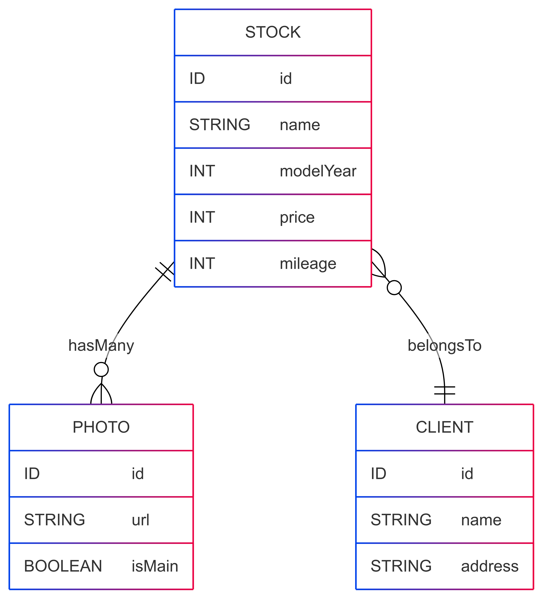
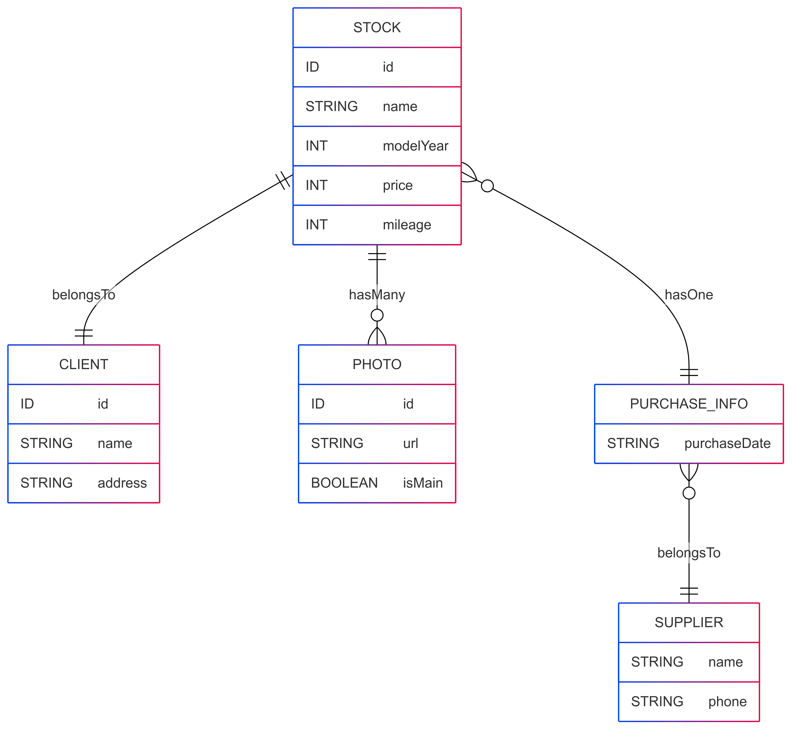

# 1. GraphQL スキーマの設計入門（中古車在庫管理編）

この章では、中古車販売店向け在庫管理システムを題材に、GraphQL のスキーマ設計を学びます。REST API とは異なり、GraphQL では**フロントエンドの取得ニーズに合わせてデータ構造を明示的に設計すること**が重要です。

---

## 🎯 本章のゴール

- GraphQL スキーマの基本構造を理解する
- "在庫 - 販売店(Client) - 写真(Photo)"というドメインモデルを元に、自分でスキーマを設計できるようになる
- Query、ObjectType、Field の責務を理解する

## 📘 スキーマ設計：題材の全体像

以下のような構成でスキーマを設計していきます。



| Entity | Field     | 型      | 必須か  |
| ------ | --------- | ------- | ------- |
| Stock  | id        | ID      | ✅ 必須 |
|        | name      | String  | ✅ 必須 |
|        | modelYear | Int     | ✅ 必須 |
|        | price     | Int     | ✅ 必須 |
|        | mileage   | Int     | ❌ 任意 |
| Client | id        | ID      | ✅ 必須 |
|        | name      | String  | ✅ 必須 |
|        | address   | String  | ❌ 任意 |
| Photo  | id        | ID      | ✅ 必須 |
|        | url       | String  | ✅ 必須 |
|        | isMain    | Boolean | ✅ 必須 |

---

## ✍️ 演習：スキーマを自分で設計してみよう

以下の仕様をもとに、GraphQL スキーマ（SDL 形式）を紙または VSCode で書いてみましょう。

### SDL 記法とは？

GraphQL スキーマ定義は SDL（Schema Definition Language）と呼ばれる形式で記述します。
例えば以下のように、ブログ記事と著者の関係を定義できます：

```graphql
type Article {
  id: ID!
  title: String!
  content: String
  author: User!
}

type User {
  id: ID!
  name: String!
  email: String
}

type Query {
  articles: [Article!]!
  user(id: ID!): User
}
```

### 要件

- 在庫車両一覧を取得する `stocks(clientId: ID!)` クエリを定義する
- 車両の詳細情報には、Client と Photo を含める
- 必須情報は `!` を付けて設計する

### 🧪 解答ファイル

実際の解答例（GraphQL スキーマの定義）は以下のファイルに記載しています：

👉 [schema-answer.graphql](./schema-answer.graphql)

ファイルを開いて内容を確認し、自分の設計と比較してみましょう。

---

## ✍️ 発展演習：後から追加された非正規化データを既存スキーマに統合せよ

ある時期から、仕入れ元の情報も在庫と一緒に持つようになりました。
このデータは、元々の在庫データベースとは別に、以下のような構造で保存されています：

| stock_id | client_id | purchase_date | supplier_name        | supplier_phone |
| -------- | --------- | ------------- | -------------------- | -------------- |
| 1        | c001      | 2024-01-01    | トヨタ中古車センター | 03-1234-5678   |

このテーブルは正規化されておらず、次のような課題があります：

- `supplier_name` と `supplier_phone` が 1 つの行にベタ書きされている
- `supplier_name` が同じでも、毎回別行で定義されてしまう（重複）
- `purchase_date` は「仕入れの出来事」に関する情報であり、本来は `Stock` とは独立した事実として扱いたい

---

### 🧠 どうするべきか？

このようなデータは、次のような **3 つの役割に分けてモデリング**するのが自然です：

| モデル名       | 意味                                         |
| -------------- | -------------------------------------------- |
| `Stock`        | 車両の在庫情報そのもの                       |
| `PurchaseInfo` | 車両の「いつ・どこから仕入れたか」という情報 |
| `Supplier`     | 仕入れ元（業者）の情報                       |

---

### 🎯 やること

- 上記のテーブルを元に、**GraphQL スキーマとしてどのように正規化して統合するか**を考えてください

#### 💡 ヒント：正規化された構造の ER 図はこちら



---

## 🧠 発展解答：仕入れ情報を含んだスキーマ（解答例）

このようなケースに対応するための設計例を、以下のファイルにまとめています：

👉 [schema-answer2.graphql](./schema-answer2.graphql)

## ✅ 次に進む

スキーマが設計できたら、次はそれをどう **分けて実装するか（Query Resolver / Field Resolver）** を見ていきます。

→ [2. Resolver の責務と分離へ進む](../02.resolver-implementation/README.md)
